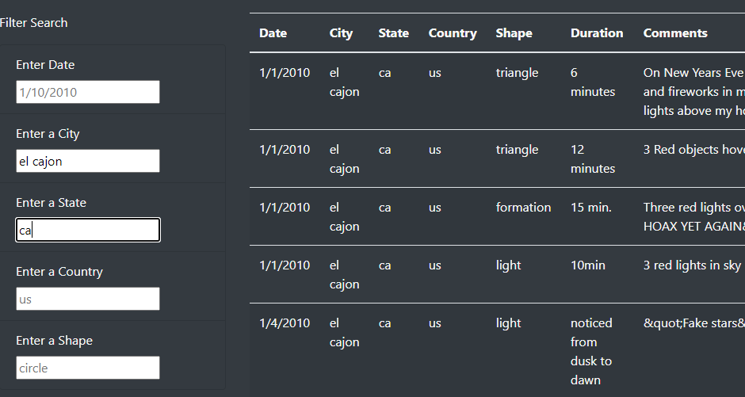
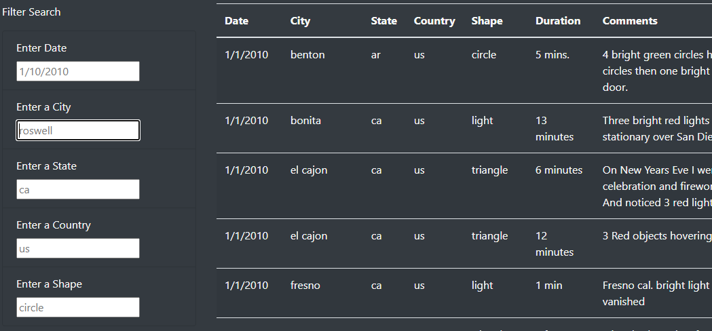

# UFOs

## Overview
The purpose of this analysis is to provide users with a Web app that lets them review UFO sightings by filtering on multiple criteria at the same time. They will be filtering on date, city, state, country and shape.

To do this, I used an index.html file to display the page. The page referenced an application JavaScript file. The data source was a JavaScript file. 
## Results
Here's how to use the page:
- You have 5 input boxes: date, city, state, country and shape. Each box contains a default value in gray that you will be typing over. When typing in your values, you will need to use the same format as the default value.
- When you first bring up the page, it shows you all the data in the database. 
- Type your criteria in the boxes:
  - The date format needs to be as shown.  
  - Text entered in all the text boxes needs to be in lower case.
  - After you type in your criteria, press enter. It will return the data based on your filters. For example, let's say I want to search on El Cajon, California. I would type "el cajon" in the city box and "ca" in the state box, and then press Enter. The results come up:

  

- If you want to go back to see all the values, delete your criteria and press Enter. The page will refresh with the full table:

  

## Summary
This webpage is very simple and provides the user with quick information. One drawback is having a default city of "roswell" because Roswell, New Mexico is not even in the database. 

Here are two recommendations for improvement:
- Put in a different default value for city, such as "el cajon." 
- Add a message telling the users "data not found" when they search on criteria not present in the database.

